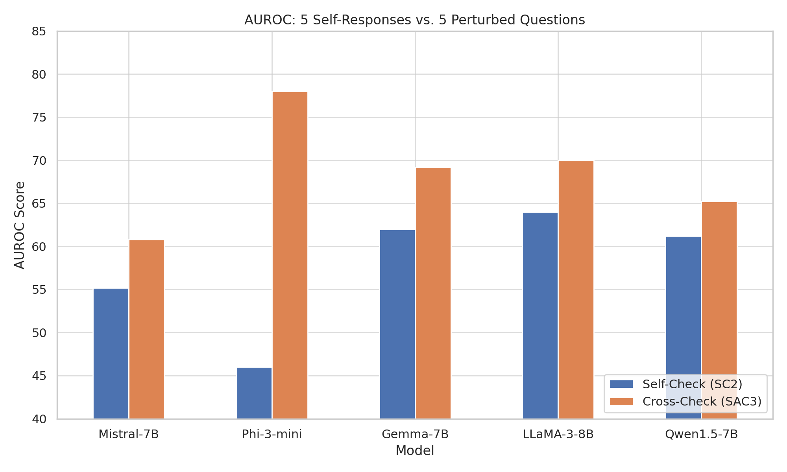
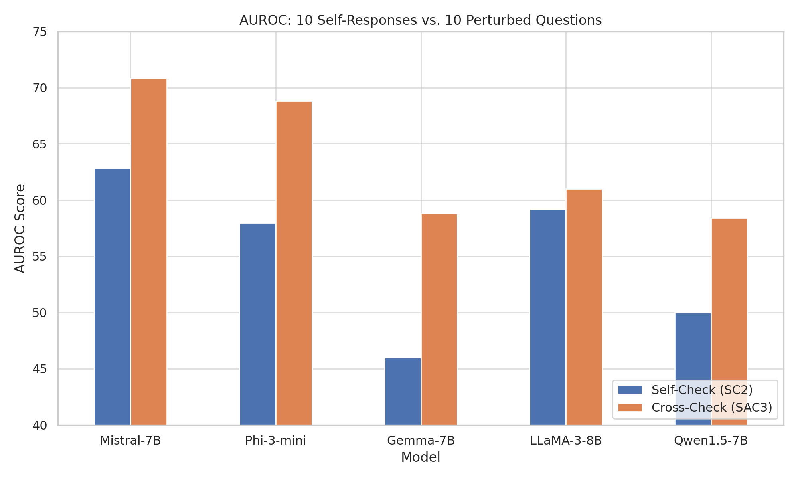

# Replicating and Extending SAC3 for Hallucination Detection in LLMs

## Introduction
This project replicates and extends the **SAC3** (Semantic-Aware Cross-Check Consistency) method for detecting hallucinations in large language models (LLMs). Originally proposed by Zhang et al. (2023), SAC3 improves on traditional self-consistency checking (SC2) by incorporating:

- **Semantically equivalent question perturbations**
- **Cross-model response consistency checks**

These mechanisms allow SAC3 to detect both **question-level** and **model-level** hallucinations more reliably.

---

## Project Overview

### Replication
- Reproduced SAC3 on binary classification (e.g., prime number, senator search) and open-domain QA tasks (e.g., HotpotQA-halu).
- Validated results using **GPT-3.5** and **GPT-4**, matching findings from the original paper.
- Evaluated performance across different self-response counts (3, 5, 10, 15) and perturbed questions (5, 10).

### Extension
- Applied SAC3 to **smaller open-source models** (<10B parameters): LLaMA-3-8B, Gemma-7B, Mistral-7B, Phi-3-mini, Qwen1.5-7B.
- Customized code and prompts for integration with each model.
- Implemented **bootstrap sampling** (50 samples/model) to improve evaluation reliability.

---

## Key Findings
- **Cross-checking with perturbed questions consistently outperformed self-consistency checks** across models.
- SAC3 is robust across diverse architectures, but performance can vary significantly—highlighting the importance of dataset diversity and GPU availability.

---

### Results Visualization

#### AUROC Comparison: 5 Responses vs. 5 Perturbed Questions


#### AUROC Comparison: 10 Responses vs. 10 Perturbed Questions


---

## Setup & Installation

### Requirements
- `Python 3.8`
- `openai <= 0.28.1`

### Install via Conda
```bash
conda create -n sac3 python=3.8
conda activate sac3
pip install -r requirements.txt
```

## Instructions

### Run in Google Colab

1. Open the notebook in Google Colab.
2. Upload or open your .ipynb file.
3. Run all cells in sequence.
4. Adjust file paths and model-specific prompts as needed.
💡 Note: For Gemma-7B-it, select A100 GPU with High-RAM in Colab.

## Citation 

```
@inproceedings{zhang2023sac3,
      title={SAC^3: Reliable Hallucination Detection in Black-Box Language Models via Semantic-aware Cross-check Consistency},
      author={Jiaxin Zhang, Zhuohang Li, Kamalika Das, Bradley Malin, Sricharan Kumar},
      booktitle={EMNLP},
      year={2023},
      eprint={2311.01740},
      archivePrefix={arXiv},
      primaryClass={cs.CL}
}
```
